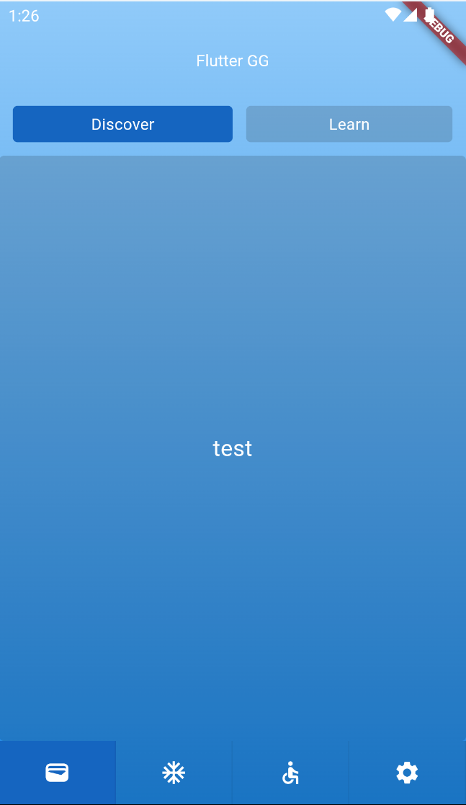

# flutter_gg_card

This project has been written in order to create an example for the Flutter_gg library.

## Getting Started

To install the project dependencies, run the following command in your terminal:

flutter pub get

## How app looks like

To learn more about flutter_gg project 

https://pub.dev/packages/flutter_gg 